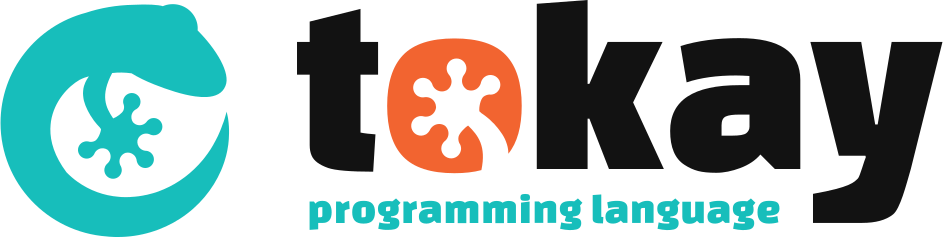

# Tokay



An imperative, procedural programming language dedicated to parsing and other text-processing tasks.

## About

Tokay is a programming language designed for ad-hoc parsing. It is inspired by [awk](https://en.wikipedia.org/wiki/AWK), but follows its own philosophy and design principles. It might also be useful as a general purpose scripting language, but mainly focuses on processing textual input and work on trees with information extracted from this input.

The language was designed to quickly create solutions in text processing problems, which can be just simple pattern matching but even major things. Therefore Tokay provides both a language for simple one-liners but also facilites to create programs like code-analysis and refactoring tools, including interpreters or compilers. For example, Tokay's own language parser is implemented in Tokay itself.

Tokay is a very young project and gains much potential. [Volunteers are welcome!](#contribute)

## Highlights

- Concise and easy to learn syntax
- Stream-based input processing
- Automatic parse tree construction and synthesis
- Left-recursive parsing structures ("parselets") supported
- Implements a memoizing packrat parsing algorithm internally
- Robust due to its implementation in only safe [Rust](https://rust-lang.org)
- Enabling awk-style one-liners in combination with other tools
- Generic functions and parselets (*coming soon)
- Import system to create modularized programs (*coming soon)
- Embedded interoperability with other programs (*coming soon)

**Tokay is still in alpha-state; There are plenty of bugs and incomplete features. Please help to improve it!**

## Examples

This is how Tokay greets the world

```tokay
print("Hello World")
```

but Tokay can also greet any wor(l)ds fed to it, like so

```tokay
world => Word   print("Hello " + $world)
```

With its automated abstract-syntax tree construction, Tokay is designed as a language for implementing ad-hoc parsers. The next example directly implements a grammar for parsing and evaluating simple mathematical expressions, like `1+2+3` or `7*(8+2)/5`. Processing direct and indirect left-recursions without ending in infinite loops is one of Tokay's core features.

```tokay
Factor : @{
    Integer             # built-in 64-bit signed integer token
    '(' Expr ')'
}

Term : @{
    Term '*' Factor     $1 * $3
    Term '/' Factor     $1 / $3
    Factor
}

Expr : @{
    Expr '+' Term       $1 + $3
    Expr '-' Term       $1 - $3
    Term
}

Expr
```

Tokay can also be used for programs without any parsing features.
Next is a recursive attempt for calculating the faculty of a value.

```
faculty : @x {
    if !x return 1
    x * faculty(x - 1)
}

faculty(4)
```

## Documentation

The full documentation of the language is currently work-in-progress, and can be obtained on the website [tokay.dev](https://tokay.dev). The documentation source code is maintained in a [separate repository](https://github.com/phorward/tokay-lang.github.io/).

## Contribute

Contributions of any kind, might it be code, bug reports + fixes, documentation, support or advertising are always welcome!

Take a look into the [TODO.md](TODO.md), the [bug tracker](https://github.com/phorward/tokay/issues) or watch for `//fixme`- and `//todo`-comments in the source code for open issues and things to be improved.

Feel free to [contact me](https://phorward.info) on any questions, or directly file [an issue here](https://github.com/phorward/tokay/issues/new).

Tokay is my first project I've started in Rust, therefore I'm sure many things inside the code could easily be improved by more experienced Rustaceans out there.

If you want to create a pull request, ensure that `cargo run` and `cargo test` (currently: `RUST_MIN_STACK=8388608 cargo test`) run without errors. When new features where added, don't miss to write some unit tests for them. Run `cargo fmt` before your finally commit.

## Logo

The Tokay programming language is named after the [Tokay gecko (Gekko gecko)](https://en.wikipedia.org/wiki/Tokay_gecko) from Asia, shouting out "token" in the night.

The Tokay logo and icon was designed by [Timmytiefkuehl](https://github.com/timmytiefkuehl), many thanks to him!

## License

Tokay and its documentation is free software under the MIT license.
Please see the LICENSE file for more details.
